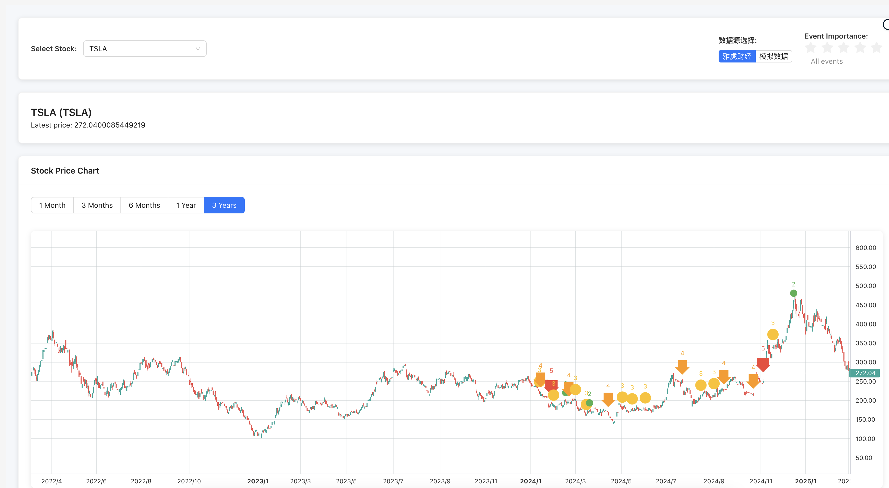

# Stock Event Tracker




## Product Concept

There's always a reason behind market fluctuations, but when reviewing historical market data, it's difficult to remember what happened behind past rises and falls. This system aims to solve this problem: connecting market events with stock trends, helping investors understand market changes more comprehensively.

Core values:
- Intuitive visualization of the correlation between events and market trends
- Display events categorized by importance (levels 1-5)
- Help investors form a more complete market understanding

## Design Approach

This system uses a front-end and back-end separated architecture:

### Front-end Design
- Based on React + TypeScript + lightweight-charts
- Uses TradingView Lightweight Charts to provide professional-level financial charts
- Displays events of different levels with colored markers on the chart
- Responsive design, supporting both desktop and mobile devices

### Back-end Design
- RESTful API built on FastAPI
- Uses SQLAlchemy ORM for database operations
- JWT authentication to protect API endpoints
- Redis caching to optimize query performance
- Scheduled tasks to fetch the latest market data
- LLM service based on LangChain for news analysis and event extraction

### Data Flow Design
```
User Request → Front-end Display ← API Service ← Database ← LLM News Analysis
```

## System Architecture Diagram

```
+------------------+    +-------------------+    +------------------+
|                  |    |                   |    |                  |
|  React Frontend  |    |   FastAPI Backend |    |  PostgreSQL DB   |
|                  |    |                   |    |                  |
+------------------+    +-------------------+    +------------------+
        ↑                        ↑                        ↑
        |                        |                        |
        ↓                        ↓                        ↓
+------------------+    +-------------------+    +------------------+
|                  |    |                   |    |                  |
| TradingView      |    | LLM Service       |    |  Redis Cache     |
| Charts           |    | (News Analysis)   |    |                  |
+------------------+    +-------------------+    +------------------+
```

## Project Structure

```
stock_reason/
├── frontend/
│   ├── public/
│   │   ├── index.html
│   │   └── assets/
│   ├── src/
│   │   ├── components/
│   │   │   ├── Chart/
│   │   │   ├── EventMarker/
│   │   │   ├── Timeline/
│   │   │   └── StockSearch/
│   │   ├── services/
│   │   ├── utils/
│   │   ├── types/
│   │   ├── styles/
│   │   ├── App.tsx
│   │   └── index.tsx
│   ├── package.json
│   └── tsconfig.json
├── backend/
│   ├── app/
│   │   ├── api/
│   │   │   ├── endpoints/
│   │   │   ├── dependencies/
│   │   │   └── middleware/
│   │   ├── core/
│   │   │   ├── config.py
│   │   │   └── security.py
│   │   ├── db/
│   │   │   ├── models/
│   │   │   └── session.py
│   │   ├── services/
│   │   │   ├── stock_service.py
│   │   │   └── event_service.py
│   │   ├── llm/
│   │   │   ├── news_analyzer.py
│   │   │   └── event_extractor.py
│   │   └── main.py
│   ├── tests/
│   ├── alembic/
│   ├── requirements.txt
│   └── Dockerfile
├── docker-compose.yml
├── .github/
│   └── workflows/
└── README.md
```

## Installation and Setup

### Front-end Development Environment

1. Clone the repository
```bash
git clone https://github.com/yourusername/stock_reason.git
cd stock_reason/frontend
```

2. Install dependencies
```bash
npm install
```

3. Start the development server
```bash
npm start
```

4. Access in browser
```
http://localhost:3000
```

### Back-end Development Environment

1. Navigate to the backend directory
```bash
cd stock_reason/backend
```

2. Create a virtual environment
```bash
python -m venv venv
source venv/bin/activate  # On Windows use venv\Scripts\activate
```

3. Install dependencies
```bash
pip install -r requirements.txt
```

4. Start the backend service
```bash
uvicorn app.main:app --reload
```

5. Access API documentation
```
http://localhost:8000/docs
```

### Deployment with Docker

```bash
docker-compose up -d
```

## Features

### Currently Implemented Features

1. **Stock Candlestick Chart Display**
   - Support for zooming and panning
   - Display OHLC candlestick chart
   - Adaptive container size

2. **Event Markers and Display**
   - Display level 1-5 event markers on chart
   - Click markers to view event details
   - Filter events by level

3. **Stock Search**
   - Input stock code to query different stock data (e.g., AAPL, MSFT)

4. **Event Timeline**
   - Display timeline of all related events
   - Click events to jump to corresponding time point

### Planned Features

1. **Backend Integration**
   - Implement event storage and management API
   - Analyze news and automatically extract events through LLM

2. **Data Expansion**
   - Support more markets and indices
   - Integrate more historical event data

3. **User Features**
   - User-defined event addition
   - Personal collections and notes
   - Event impact analysis reports
   - Custom alerts

4. **Community Features**
   - User-contributed events and ratings
   - Discussion area and comment system

## Project Roadmap

### Phase 1 (MVP) - Q3 2023
- ✅ Basic chart display function
- ✅ Static event marking and display
- ✅ Basic stock search

### Phase 2 - Q4 2023
- ✅ Event timeline function
- ✅ Event filtering function
- 🔄 Backend API development

### Phase 3 - Q1 2024
- 🔄 LLM news analysis integration
- 🔄 User account system
- 🔄 Custom event addition

### Phase 4 - Q2 2024
- 📅 Community features
- 📅 Advanced data analysis
- 📅 Mobile application development

## API Documentation

Complete API documentation can be accessed after starting the backend service:
```
http://localhost:8000/docs  # Swagger UI
http://localhost:8000/redoc  # ReDoc
```

### Core API Endpoints

1. Stock Data API
   - `GET /api/stocks/{symbol}` - Get basic information for a specific stock
   - `GET /api/stocks/{symbol}/prices` - Get stock price history
   - `GET /api/stocks/{symbol}/events` - Get stock-related events

2. Event API
   - `GET /api/events` - Get all events
   - `POST /api/events` - Create a new event
   - `GET /api/events/{id}` - Get details of a specific event
   - `PUT /api/events/{id}` - Update an event
   - `DELETE /api/events/{id}` - Delete an event

3. User API
   - `POST /api/users/register` - User registration
   - `POST /api/users/login` - User login
   - `GET /api/users/me` - Get current user information

## Screenshots

*Screenshots of the application interface will be added here, showing the main features*

1. Main Interface
2. Event Markers and Details
3. Timeline Display
4. Search Function

## Data Sources

Current version uses:
- Market Data: Unofficial Yahoo Finance API
- Event Data: Simulated generation (will connect to real data later)

Planned integrations:
- Financial news sources
- Company announcement data
- Macroeconomic data

## Testing Strategy

This project adopts a multi-level testing strategy:

1. Unit Tests
   - Frontend component testing: Jest + React Testing Library
   - Backend function testing: Pytest

2. Integration Tests
   - API endpoint testing
   - Data flow testing

3. End-to-End Tests
   - Key user flow testing with Cypress

Running tests:
```bash
# Frontend tests
cd frontend
npm test

# Backend tests
cd backend
pytest
```

## Technology Stack

### Frontend
- React 17+
- TypeScript 4+
- TradingView Lightweight Charts
- CSS3 (custom styles)
- Jest

### Backend
- Python 3.9+
- FastAPI
- SQLAlchemy
- LangChain
- Pytest
- Redis
- PostgreSQL

## Deployment Guide

### Deploying with Docker

1. Ensure Docker and Docker Compose are installed
2. Clone the repository
3. Configure environment variables (can copy `.env.example` to `.env` and fill in configuration)
4. Execute deployment command
```bash
docker-compose up -d
```

### Manual Deployment

#### Frontend
```bash
cd frontend
npm install
npm run build
# Deploy the build directory to your web server
```

#### Backend
```bash
cd backend
python -m venv venv
source venv/bin/activate
pip install -r requirements.txt
# Configure environment variables
uvicorn app.main:app --host 0.0.0.0 --port 8000
```

## License

MIT

## Contribution Guidelines

We welcome community contributions! Here's how to participate in the project:

### Contribution Process

1. Fork this repository
2. Create your feature branch (`git checkout -b feature/amazing-feature`)
3. Commit your changes (`git commit -m 'Add some amazing feature'`)
4. Push to the branch (`git push origin feature/amazing-feature`)
5. Open a Pull Request

### Types of Contributions

We welcome the following types of contributions:
- Code improvements and new features
- Documentation improvements
- Bug fixes
- Test cases
- UI/UX design improvements
- News source integrations
- Data analysis algorithms

### Code Standards

- Please follow the existing code style in the project
- Add appropriate comments
- Ensure all tests pass
- Add tests for new features

### Issue Submission

If you find a problem but don't have time to fix it, please submit an Issue:
- Clearly describe the problem
- Provide steps to reproduce
- If possible, attach screenshots or logs
- Tag with relevant labels

## Contact Information

- Project Lead: [Your Name]
- Email: [Your Email]
- WeChat: [Your WeChat]
- GitHub: [Your GitHub Homepage] 